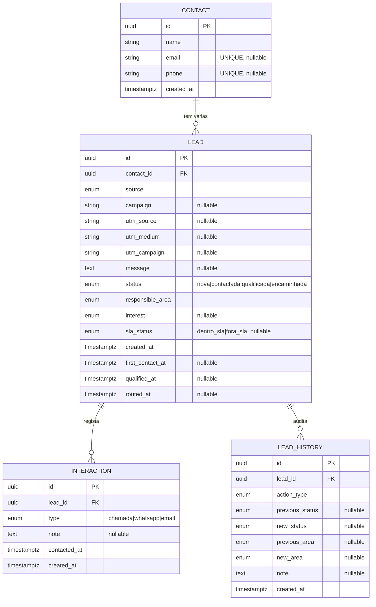

# 4Improvements — Gestão de Leads (MVP)

Sistema completo de gestão do ciclo inicial de leads de uma imobiliária — **da entrada ao encaminhamento** — com persistência, validação, SLA, histórico de ações, orquestração por IA (n8n) e interface visual. Desenvolvido como teste técnico (**Especialista em N8N e Infraestruturas de Inteligência Artificial**).

- 🖥️ **Frontend:** https://portfloio-4-improvements-front.e4xqua.easypanel.host
- 🌐 **API:** https://portfloio-4-improvements.e4xqua.easypanel.host
- 📖 **Swagger:** https://portfloio-4-improvements.e4xqua.easypanel.host/docs
- ❤️ **Health:** [`/health`](https://portfloio-4-improvements.e4xqua.easypanel.host/health) · [`/health/db`](https://portfloio-4-improvements.e4xqua.easypanel.host/health/db)

---

## Índice
1. [Arquitetura](#arquitetura)
2. [Modelo de dados](#modelo-de-dados)
3. [Regras de negócio](#regras-de-negócio)
4. [Endpoints](#endpoints)
5. [Cenários do enunciado](#cenários-do-enunciado)
6. [Como executar](#como-executar)
7. [Testes](#testes)
8. [Deploy](#deploy)
9. [Camada n8n (extra)](#camada-n8n-extra)
10. [Decisões técnicas](#decisões-técnicas)

---

## Arquitetura

O **backend FastAPI** é a *fonte da verdade* — implementa, sozinho, **todos os requisitos obrigatórios** do teste. Por cima dele, uma camada **n8n** (extra) adiciona orquestração, IA e notificações, sempre chamando o backend por HTTP (nunca duplicando regra de negócio).

```
        ┌───────── n8n (extra: integrações/IA) ─────────┐
 Lead ▶ │ Fluxo 1: ingestão · Fluxo 2: IA · Fluxo 3: SLA│
        └───────────────────────┬───────────────────────┘
                                 │ HTTP
                                 ▼
        ┌──────────────── Backend FastAPI ──────────────┐
        │ Clean Architecture: api → services → models   │
        │ Regras: dedup · SLA 30min · interesse→área     │
        └───────────────────────┬───────────────────────┘
                                 ▼
                       Supabase PostgreSQL
```

### Organização do código (Clean Architecture)

```
backend/
├── main.py                      # bootstrap FastAPI, metadados Swagger, handlers de erro
├── app/
│   ├── api/leads.py             # rotas (camada fina — sem regra de negócio)
│   ├── services/lead_service.py # regras de negócio (núcleo testável)
│   ├── schemas/lead.py          # contratos Pydantic (entrada/saída + exemplos)
│   ├── models/                  # entidades SQLAlchemy + enums (+ INTEREST_TO_AREA)
│   └── core/                    # config, database, exceptions
├── alembic/                     # migração do schema
└── scripts/                     # smoke tests manuais
```

A separação garante que a **rota** só traduz HTTP, o **service** concentra a lógica (reutilizável por rotas e integrações), e os **models/schemas** isolam persistência de contrato. Erros de domínio (`NotFoundError`, `ConflictError`) são lançados no service e traduzidos para HTTP (404/409) por *exception handlers* — o service não conhece o FastAPI.

---

## Modelo de dados

Quatro entidades, separando claramente **pessoa** (`Contact`) de **oportunidade** (`Lead`):



| Entidade | Objetivo |
|---|---|
| **Contact** | Representa a pessoa **sem a duplicar**. `email` e `phone` são `UNIQUE` (e *nullable* — várias leads podem não ter um dos dois). |
| **Lead** | Cada nova oportunidade. **Um contacto → várias leads**, cada uma com o seu estado e histórico. |
| **Interaction** | Regista contactos efetuados (o 1.º contacto cria uma interação `chamada/whatsapp/email`). |
| **LeadHistory** | Evento de auditoria das ações críticas (criação, contacto, qualificação, encaminhamento, SLA). |

> **Separação contacto ↔ lead** é o ponto central da modelação (25% da nota): a dedup acontece no contacto; o histórico e o estado vivem na lead. Assim "a Maria que comprou há 2 meses" e "a Maria que agora quer crédito" partilham contacto mas têm leads e históricos independentes.

---

## Regras de negócio

| Regra | Implementação |
|---|---|
| Lead nasce `nova` + `inside_sales` | `default` no model + garantido no `create_lead` |
| Não duplicar contacto | `SELECT` por `email` **OU** `phone` antes de criar (`_find_existing_contact`) |
| Um contacto → várias leads | FK `lead.contact_id`; nova lead sempre criada |
| Validação | `name`+`source` obrigatórios e **pelo menos um** de `email`/`phone` (Pydantic) |
| SLA 30 min | `first_contact_at - created_at ≤ 30min`, no **relógio do banco** (`func.now()`) |
| Interesse → área | mapa `INTEREST_TO_AREA` aplicado na qualificação |
| Histórico de ações críticas | `LeadHistory` em criação, contacto, qualificação, encaminhamento e SLA |

**Ciclo de estados:** `nova → contactada → qualificada → encaminhada`

**Mapa interesse → área de encaminhamento:**

| Interesse | Área |
|---|---|
| `comprar_imovel` | `buyer_advisory` |
| `vender_imovel` | `sell_advisor_mediacao` |
| `credito_habitacao` | `credito_habitacao` |
| `investimento_spv` | `spv_investimentos` |

> **Onde "ver" o encaminhamento:** a área é a coluna `responsible_area` da lead. Para ver as leads de uma área, filtre: `GET /leads?responsible_area=buyer_advisory`.

---

## Endpoints

| Método | Rota | Descrição |
|---|---|---|
| `POST` | `/contacts/leads` | Cria lead (cria ou reutiliza o contacto). |
| `GET` | `/leads` | Lista com filtros (`status`, `responsible_area`, `sla_status`) + paginação. |
| `GET` | `/leads/{id}` | Detalhe de uma lead. |
| `POST` | `/leads/{id}/first-contact` | Regista 1.º contacto e calcula o SLA. |
| `POST` | `/leads/{id}/qualification` | Qualifica pelo interesse **e** encaminha (mesma transação). |
| `GET` | `/leads/{id}/history` | Histórico/auditoria da lead. |
| `POST` | `/leads/sla/check` | Marca leads atrasadas como `fora_sla` (consumido pelo n8n). |
| `GET` | `/health` · `/health/db` | Saúde da app e da conexão ao banco. |

Documentação interativa completa (com exemplos e códigos de erro): **`/docs`** (Swagger) e **`/redoc`**.

---

## Cenários do enunciado

Todos os 5 cenários obrigatórios estão cobertos (e testados — ver [Testes](#testes)):

| Cenário | Verifica | Estado |
|---|---|---|
| 1 — Nova lead de comprador | contacto+lead criados, `nova`/`inside_sales`, histórico | ✅ |
| 2 — 1.º contacto dentro do SLA | `contactada` + `dentro_sla` | ✅ |
| 3 — Qualificação e encaminhamento | `comprar_imovel` → `buyer_advisory` → `encaminhada` | ✅ |
| 4 — Contacto existente, nova oportunidade | reutiliza contacto, nova lead, histórico próprio | ✅ |
| 5 — Lead fora do SLA | `fora_sla` visível na consulta e nos filtros | ✅ |

---

## Como executar

Requisitos: **Python 3.11** e uma base **PostgreSQL** (ex.: Supabase).

```bash
cd backend
py -3.11 -m venv .venv
.venv\Scripts\activate              # Windows  (Linux/Mac: source .venv/bin/activate)
pip install -r requirements.txt

copy .env.example .env              # preencher DATABASE_URL
alembic upgrade head                # cria o schema (idempotente)

uvicorn main:app --reload --port 8080
```

Abra http://localhost:8080/docs.

Variáveis de ambiente ([`.env.example`](backend/.env.example)):

| Variável | Descrição | Default |
|---|---|---|
| `DATABASE_URL` | Conexão PostgreSQL (`postgresql+asyncpg://...`) | — (obrigatória) |
| `SLA_MINUTES` | Minutos do SLA do 1.º contacto | `30` |
| `CORS_ORIGINS` | Origens permitidas (CSV) | `http://localhost:5173` |
| `APP_ENV` | `development` ativa logs SQL | `development` |

---

## Testes

```bash
cd backend
pytest                                 # suíte automatizada (comportamentos mínimos do enunciado)

# ou os smoke tests manuais (contra um banco real):
python -m scripts.smoke_create_lead    # criação + dedup + validação
python -m scripts.smoke_lifecycle      # ciclo completo
```

A suíte cobre os comportamentos mínimos exigidos: criação válida, rejeição sem e-mail/telefone, reutilização de contacto, SLA dentro/fora dos 30 min, e roteamento comprador/vendedor.

---

## Deploy

Ambos os serviços correm em **EasyPanel** via Docker Compose, na mesma rede externa `easypanel`.

| Serviço | Repositório | Dockerfile | URL |
|---|---|---|---|
| **Backend** | `4Improvements` | `backend/Dockerfile` (python:3.11-slim) | https://portfloio-4-improvements.e4xqua.easypanel.host |
| **Frontend** | `relay-leads` | `Dockerfile` (node:20-alpine, multi-stage) | https://portfloio-4-improvements-front.e4xqua.easypanel.host |

O backend executa `alembic upgrade head` no arranque antes de subir o `uvicorn` (porta 8080). O frontend é uma app SSR (TanStack Start + Nitro `node_server`) que corre na porta 3000; o `VITE_API_BASE_URL` é baked no bundle em tempo de build.

> Deploy não era obrigatório (fora do escopo do enunciado) — incluído para demonstração end-to-end.

---

## Camada n8n (extra)

Documentação detalhada dos workflows em **[N8N_fluxos/README.md](N8N_fluxos/README.md)**. Resumo:

- **Fluxo 1 — Ingestão:** webhook → validação → dedup → cria lead + histórico.
- **Fluxo 2 — Qualificação por IA:** webhook → **OpenAI `gpt-4.1-mini`** classifica o interesse a partir da mensagem → `POST /leads/{id}/qualification`.
- **Fluxo 3 — SLA:** *Schedule* → `POST /leads/sla/check` → notificação por **WhatsApp (WAHA)**.

> IA, WhatsApp e deploy estão **fora do escopo obrigatório**; são extras que demonstram a parte de integrações/IA. A regra de negócio permanece toda no backend — o n8n só orquestra.

---

## Decisões técnicas

- **Stack:** FastAPI + SQLAlchemy 2 (async/asyncpg) + Alembic + Pydantic v2 + PostgreSQL. Escolha por produtividade, tipagem forte, documentação automática (Swagger) e I/O assíncrono nativo — adequado a uma API de integrações.
- **Qualificação e encaminhamento no mesmo endpoint:** o enunciado permite-o desde que justificado. Como o interesse **determina deterministicamente** a área, separá-los criaria um estado intermédio inútil (`qualificada` sem área). Faço os dois numa **transação atómica**, gravando **dois registos** de histórico (`qualificacao` e `encaminhamento`) para manter a rastreabilidade.
- **SLA pelo relógio do banco:** `created_at` é gerado pelo PostgreSQL; calcular a duração com o relógio da aplicação misturaria fontes de tempo e falsearia o SLA. Uso `func.now()` (relógio do banco) em ambos os lados.
- **Enums como VARCHAR (`native_enum=False`):** evita `CREATE TYPE`/conflitos de migração no Postgres e simplifica adicionar valores; a validação fica na aplicação (Pydantic/SQLAlchemy).
- **Supabase Session Pooler (porta 5432):** compatível com IPv4 (necessário no VPS) e com *prepared statements* do asyncpg — ao contrário do Transaction Pooler.
- **Histórico append-only:** cada ação crítica insere uma linha em `lead_history` com estado/área anterior e posterior — auditoria completa sem mutação.
- **Segurança básica:** segredos fora do código (`.env` git-ignored, `.env.example` versionado), CORS configurável, validação de entrada no contrato Pydantic.
- **Pré-qualificação por IA (n8n):** a IA infere o interesse a partir da mensagem inicial como auxílio de produtividade; o **1.º contacto humano e o SLA continuam ações separadas** — o sistema não confunde "qualificada pela IA" com "contactada por uma pessoa".

### Evolução futura
Trocar os nós Postgres do Fluxo 1 por `POST /contacts/leads`; encadear Fluxo 1 → Fluxo 2; autenticação nos webhooks e na API; *rate limiting*; testes de integração em CI (GitHub Actions).

---

## Stack

FastAPI · SQLAlchemy 2 (async/asyncpg) · Alembic · Pydantic v2 · PostgreSQL (Supabase) · Docker/EasyPanel · n8n · OpenAI (no n8n) · WAHA.
